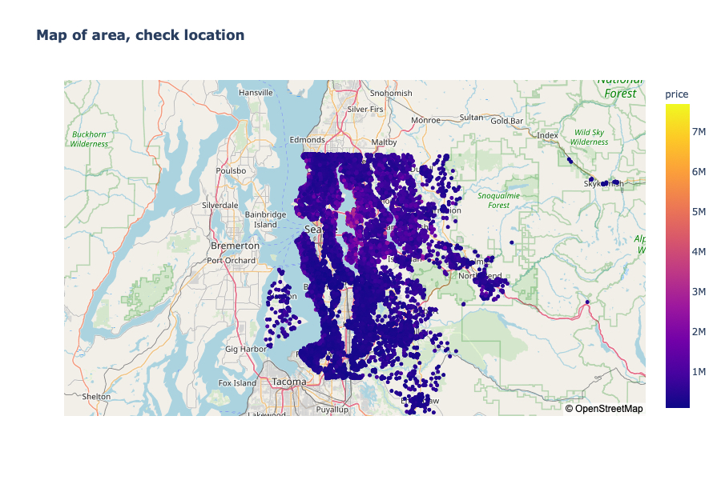

# Module 2 Final Project

_Note: The housing shortage has had a bad influence on ..._

Predicting the sale price of properties is an important and challenging problem. This project provides details of our attempt to predict house prices using various regression methods. \
I will be using the House Sales in King County, USA dataset. The dataset contains information about the number of Bedrooms, Square Footage, Grade, Sale Price and related information for 21,597 houses for sales in 2014 and 2015. \
Main question for this project: “Is it possible to predict the sale price of a house from information about that house such as the size, number of bedrooms, condition etc?” 

I used OSEMN framework to cover every step of the data science project lifecycle from begining to end.\
All information about me and additional links to Blog and Walkthrough [here](00_student.ipynb)

## Obtain
Before I process or change the data, let’s just get an idea of what we are dealing with. The dataset can be found in the file `"kc_house_data.csv"`. Based on information from this file, I created a King County map.

[Here](01_Obtain.ipynb) I put all facts, what I should know before work.

## Scrubbing
Datasets in the real world are never perfect. There will always be missing values and outliers that skew the dataset, affecting the accuracy of our predictive model. That’s why it is always a good idea to clean up the data before you start building your model.
Scrubbing included:
* Changing data types (convert columns type to types)
* Filling in any missing values (NaN/null, other interesting solutions for the unknown values)
* Making decisions on outliers (are there enough 33 bathrooms? How many millionaire houses we have? how many football fields are located in the backyard?)

[This notebook](02_Scrubbing.ipynb) include all my thought about scrubbing data and decisions on outliers. 

## Explore

[This notebook](03_Explore.ipynb) include all my work about features and answers for questions:

1. Do we pay more for older or for modern houses?

After all research, I can say: Renovated home has a price 157,404 more than a home that wasn't renovated.

2. What features are most important in predicting the price of a house: condition or grade?

I found a strong correlation between grade and home price: the higher the grade your home receives the more prices your home will sell for. It's makes sense because grade represents the construction quality of improvements. If home has higher quality then we are going to sell itfor a higher value. This feature should go into the final model. But I didn't find the same correlation for conditions. I expected a more pronounced dependence, maybe we need to do any more manipulation with data.

3. How the size of a home affect its sale price?

.png)
## Conclusion

If you're looking for a higher priced home in King County Washington you'll likely find one

* closer to Seattle, possibly in the Bellevue area
* with a good construction grade
* if a waterfront home is desired, most are higher priced.

## Further work

* Future data analysis should include school zones.
* Further analysis could be made of moderately priced homes.
